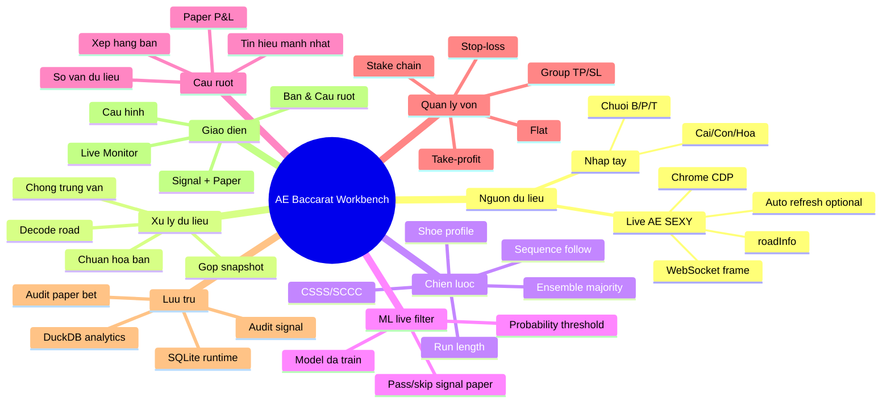

# Workflow Prototype

Tài liệu này mô tả tool hiện tại theo hướng desktop Windows, đọc live AE SEXY, signal và paper trading. MVP không có auto-bet.



## Luồng xử lý

1. **Nguồn dữ liệu**: app nhận snapshot từ Chrome CDP/WebSocket hoặc chuỗi nhập tay.
2. **Decoder**: `ae_decode.py` tìm `roadInfo`, đổi mã road thành `Cai/Con/Hoa`, chuẩn hóa tên bàn kiểu `Baccarat C03`.
3. **Engine**: `engine.py` gộp snapshot mới vào lịch sử bàn, bỏ trùng theo fingerprint, lưu rounds.
4. **Settle paper trade**: nếu có bet ảo đang chờ, ván mới nhất sẽ được dùng để settle P&L.
5. **Tạo signal mới**: các strategy đọc lịch sử bàn và xuất `bet/skip`, cửa, confidence, lý do.
6. **Cầu ruột**: bảng ranking ưu tiên bàn có signal mạnh, đủ dữ liệu, và paper P&L đang tốt.
7. **Audit**: SQLite lưu mọi round/signal/paper bet; DuckDB mirror dùng cho phân tích offline khi cài package.

ML live filter chạy sau bước strategy tạo signal và trước khi arm paper bet.
Nếu model đã train sẵn sàng, app tính `ml_probability_win`; tín hiệu dưới
threshold sẽ được đổi thành `skip` và không tạo paper bet mới. Nếu ML filter
đang bật nhưng model/package thiếu, app cũng skip tín hiệu mới để không đưa
tín hiệu chưa được duyệt vào trạng thái đang chờ.

## DuckDB analytics layer

SQLite is the durable runtime store. DuckDB is always requested by config when
the package is installed, and it is used as the analytics mirror for reporting,
feature engineering, and future ML training.

DuckDB base tables:

- `tables`
- `rounds`
- `signals`
- `paper_bets`
- `latency_samples`

DuckDB analytics views:

- `paper_bet_results`: win/loss/push labels and P&L labels for settled paper bets.
- `paper_wl_streaks`: win/loss streak length per table and strategy.
- `round_streaks`: Banker/Player/Tie streak length per table and shoe.
- `table_round_summary`: result counts and first/last seen by table.
- `strategy_performance`: win rate, total P&L, max win streak, and max loss streak.
- `ml_rolling_features`: ML-ready rows using only pre-signal table, shoe, and strategy history.

If the live provider sends full road history, the app stores the whole visible
shoe history. If it sends only latest results, the app stores only observed
results but still uses `round_no`/`gameRound` as the current shoe position. The
dashboard shows `current/saved` when early results are missing, and the engine
skips new signals after `stop_signals_after_round` while still saving results.

## Offline ML workflow

The first ML path is intentionally offline:

```powershell
pip install -e ".[ml]"
python -m ae_baccarat_workbench.ml --features-only
python -m ae_baccarat_workbench.ml --min-rows 30
python -m ae_baccarat_workbench.ml --evaluate --model xgboost --decision-threshold 0.55
```

Feature source view:

- `ml_rolling_features`

The target is `target_win`, derived from settled paper bets in
`paper_bet_results`. Rolling columns obey the pre-signal rule: table/shoe
history is counted only up to the signal round, and model/strategy performance
uses only paper bets with `settled_at < created_at` for the current signal. The
feature frame keeps outcome labels and P&L columns for audit/export, but the
model feature list excludes settled-result leakage such as `wl_result`,
`settled_outcome`, `pnl_delta`, and `pnl_after`.

Training uses a chronological split: older rows train, newer rows test. The
first baseline is scikit-learn logistic regression; XGBoost is trained when the
package is installed. Outputs are saved under `data/ml/`.
The full-period views `strategy_performance` and `table_round_summary` remain
for analytics dashboards, not direct model input.

Live paper trading selects only one ML Pass per table and
`signal_fingerprint`: the highest-probability strategy is armed, while all
strategy signals remain stored for audit and offline analysis.

Passive latency samples are stored in `latency_samples`. They measure from the
app's CDP callback through queue wait, engine processing, and UI refresh. They
do not prove casino-server-to-Chrome latency unless a trusted server timestamp
is present in the provider payload.

Evaluation reports are written to `data/ml/`:

- `evaluation_thresholds_<model>.csv`: win rate and coverage at each probability threshold.
- `evaluation_by_strategy_<model>.csv`: selected signals by strategy at the decision threshold.
- `evaluation_by_table_<model>.csv`: selected signals by table at the decision threshold.
- `evaluation_report_<model>.md`: compact human-readable summary.

## Công cụ hỗ trợ nên dùng

- **Playwright**: kết nối Chrome CDP và nghe WebSocket read-only.
- **SQLite**: lưu runtime, audit, trạng thái paper trading nhẹ và bền.
- **DuckDB**: phân tích batch/offline nhiều shoe, nhiều bàn, xuất báo cáo sau phiên.
- **Tkinter**: desktop Windows MVP không cần Electron, dễ đóng gói.
- **PyInstaller**: đóng gói `.exe` sau khi prototype ổn định.
- **pytest/unittest**: giữ test regression cho decoder, strategy, money, engine.

## Ranh giới an toàn

- Không click/đặt chip.
- Không lưu credential.
- Không bypass captcha/anti-bot.
- Chỉ đọc dữ liệu người dùng đang xem trong Chrome debug do người dùng tự mở.
